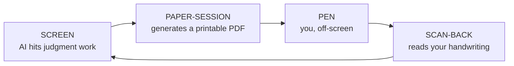
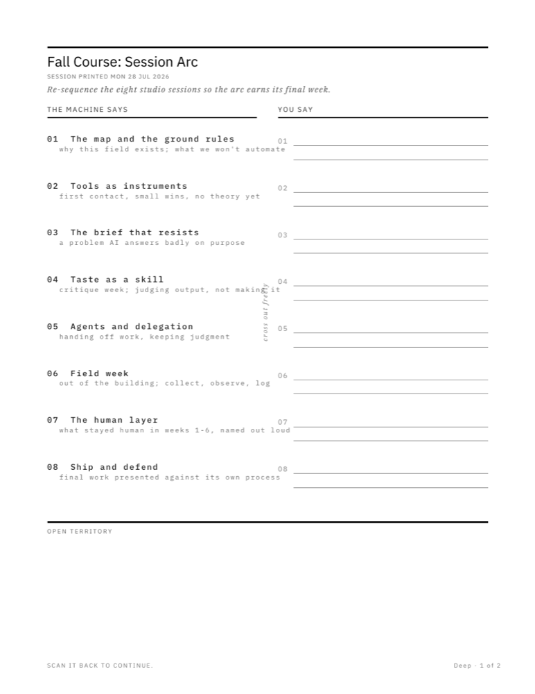
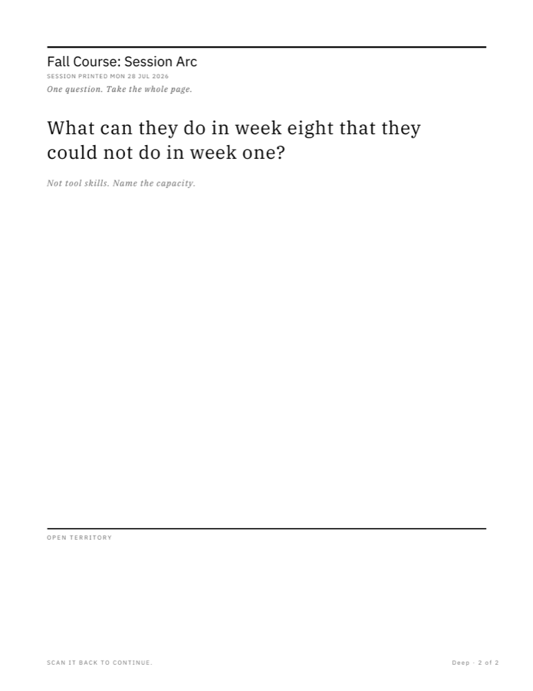
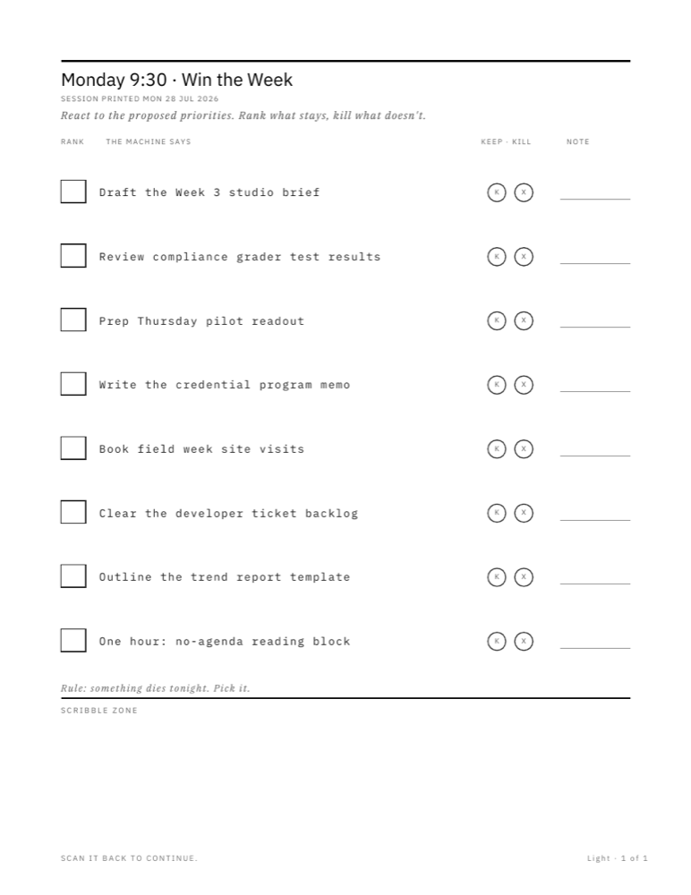

# Paper Session

**Two Claude skills that stop the AI mid-task, hand the thinking to you on paper, and pick the work back up from your handwriting.**

In agentic workflows the bottleneck is no longer AI output. It's your ability to metabolize that output. When a task reaches work that is genuinely yours — sequencing, weighing tradeoffs, naming something, deciding what matters — the right move is to stop generating and get off the screen.

`paper-session` prints the artifact that carries that handoff. `scan-back` reads your pen marks and resumes the workflow as if it never paused.



---

## What comes out of the printer

Three real sheets, generated by the skill. No hand-tuning, no per-sheet design work — every one of these is built programmatically from a numeric spec.

| Deep · two-column react | Deep · one provocation | Light · rank-and-circle |
|---|---|---|
|  |  |  |
| The AI's proposal on the left in the machine's voice. Empty numbered slots on the right. A rotated hint in the gutter: *cross out freely*. | One hard question. The rest of the page is deliberately, structurally empty. | Eight items, one pen gesture each. A standing house rule: *something dies tonight. Pick it.* |

Notice what is **not** there: no example answers, no suggested duration, no scoring rubric, no encouragement, no QR code. Each of those absences is a deliberate design rule with research behind it.

---

## The one rule everything else serves

> **Whose thought does this slot belong to?**

- **The AI contributes** where it has done work worth reacting to — a proposed order, gathered options, a draft sequence, one well-chosen analogy. Print it so you can re-rank it, cross it out, argue with it in the margin.
- **The AI withholds** where you are better — creative generation, judgment calls, naming, deciding what matters. Print the provocation. Leave the space empty.

When in doubt, withhold. A worksheet that is *too helpful* defeats the entire purpose.

This isn't just a stance. Design fixation is the most replicated finding in design cognition: show someone an example and their ideas come to resemble it, producing fewer ideas across fewer distinct categories. Telling them not to copy **does not fix it** — groups instructed to avoid an example incorporated its features at the same rate as groups given no instruction at all. The layout has to do the work, so the layout does.

---

## Install

Install **both** skills, whatever your setup — they're a loop: `paper-session` prints "SCAN IT BACK TO CONTINUE." on every footer, and `scan-back` is what honors that promise.

**If your AI lives in a chat app** — claude.ai, the Claude desktop or mobile apps, or any client that accepts skill bundles — download the two packaged bundles and upload them where your client takes skills. No terminal, no unzipping:

[`paper-session.skill`](https://raw.githubusercontent.com/welovejeff/paper-session/main/paper-session.skill) · [`scan-back.skill`](https://raw.githubusercontent.com/welovejeff/paper-session/main/scan-back.skill)

**If your AI runs in a terminal or IDE** — the [`skills` CLI](https://github.com/vercel-labs/skills) finds both skills in this repo and routes them to Claude Code, Cursor, Codex, Copilot, and 70+ other agents:

```bash
npx skills add welovejeff/paper-session
```

Project-level by default; `-g` installs user-level (for Claude Code, `~/.claude/skills/`). `--list` shows what you're getting first; `-a <agent>` names the target.

**No Node?** The bundles are ordinary zips — clone and unzip into your skills directory:

```bash
git clone https://github.com/welovejeff/paper-session.git
cd paper-session
unzip -o paper-session.skill -d ~/.claude/skills/
unzip -o scan-back.skill -d ~/.claude/skills/
```

Generating sheets needs `reportlab`; the mandatory layout verifier needs `pdfplumber`. A CLI or upload install doesn't bring `requirements.txt` along, so install them directly:

```bash
python3 -m pip install reportlab pdfplumber    # or: -r requirements.txt, if you cloned
```

### Where the loop stands, agent by agent

| Your agent | Install | The loop today |
|---|---|---|
| **Claude Code** (CLI, IDE, web) | `npx skills add`, or clone-and-unzip | **Verified end to end** — discovery, install, sheet generation, and scan-back all tested |
| **claude.ai · Claude desktop · mobile** | upload the two `.skill` files | **Supported** — the chat-native path; a phone photographing the pages is what the return trip was built around |
| **Cursor · Codex · Copilot · other CLI-routable agents** | `npx skills add … -a <agent>` | **Installs cleanly, loop untested** — the sheets need an agent that can run reportlab and read photographs back. A session report from one of these is the contribution we want most |
| **Anything else that reads `SKILL.md` folders** | download a `.skill` (it's a zip), unzip into the agent's skills directory | Same as above |

Install directions live in this section and nowhere else in the repo — other documents link here rather than restating commands, so there is exactly one place to keep true.

---

## Using it

The skills are written to trigger themselves. You mostly don't invoke them.

**It offers, mid-task:**

> **You:** Help me restructure the fall course. Eight studio sessions, and week eight currently lands flat.
>
> **Claude:** I can map the constraints, but the actual re-sequencing is judgment work — you know what these students can carry. Want a printable so you can work it out on paper, then scan it back?

**Or you ask directly:**

```
Give me a paper session on this.
I need to think about this offline.
Print me something for the patio.
```

**Then it stops.** After handing you the PDF, the skill will not keep working the problem or quietly produce the answers the sheet is asking you for. The closing message is short by design. *"Printed. Go think."*

**Coming back**, drop the photos in the chat with no message at all:

> **You:** *[four phone photos of marked-up pages]*
>
> **Claude:** Read them. You collapsed weeks 2 and 3, moved field week to five, and killed "Ship and Defend" outright — struck through in red, so it's gone. The margin note next to week six is the interesting one: *"they don't have taste yet, that's the whole problem."* That reframes the arc as a taste-building progression rather than a skills progression. Here's the re-sequenced eight weeks built on that…

Your handwriting wins. Where your pen contradicts what the AI proposed earlier, the pen is right, silently and completely. No relitigating, no gentle pushback on a judgment you already settled.

### Deep or Light

The skill infers which you need from context and time of day, and asks at most one question.

| | **Deep** | **Light** |
|---|---|---|
| **Feels like** | clipboard on a patio, cleared block | couch, possibly during TV |
| **Roughly** | 30–60 min | 10–20 min |
| **Pages** | 2–4 max | exactly 1 |
| **Good for** | sequencing, weighing, novel concepts, introspection | sorting, ranking, gut-calls, reacting |
| **Per item** | sustained thought | one pen gesture |

A Deep provocation on a Light sheet simply will not get done. That's why the distinction is enforced in the design system, not left to taste.

---

## The pen protocol

The printed layer is grayscale by law, which reserves the entire color channel for you. Ink hue and a small mark vocabulary carry machine-readable intent on the return trip — with zero apps, accounts, or special pens.

| Ink | Means | Mnemonic |
|---|---|---|
| **Black** | notes, context, general text | the default voice |
| **Red** | needs review, stop, delete, push back on this | red flags it |
| **Green** | approved, yes, move forward | green is go |
| **Blue** | an instruction to the AI: do this on return | blue is do |

| Mark | Means |
|---|---|
| ~~strikethrough~~ | kill it — a considered rejection, not an absence |
| ⭕ circle | elevate it, this matters |
| `?` | explain or expand this on return |
| `!` | priority |
| ⭐ star | worth keeping beyond this task |
| → arrow | sequence or causation: this leads to that |
| `@name` | route it to a person, tool, or system |
| `TLDR:` | treat this line as the zone's headline answer |

**You can redefine any of it.** Write "green = new concept" anywhere on the page and that legend governs the whole session — a handwritten legend outranks the printed ink key, which outranks these defaults. And the protocol is entirely optional: a sheet completed in black ballpoint with no marks is fully valid. The channels add intent; their absence subtracts nothing.

---

## Anatomy of a sheet

Every page in the system decompresses downward — tightest structure at the top, open territory always last. The hand learns the gravity: start guided, end wandering.

```
┌────────────────────────────────────────────────┐
│ ═══════════════════════════════════════════════│ ← 2pt datum rule, every page
│ Fall Course: Session Arc                       │ ← title, Sans Bold 16
│ SESSION PRINTED MON 28 JUL 2026                │ ← metadata, tracked caps
│ Re-sequence the eight studio sessions…         │ ← intent line, Serif Italic
│                                                │
│ THE MACHINE SAYS         │ YOU SAY             │ ← named voices, 1.6pt underline
│ ─────────────────────    │ ──────────          │
│ 01  The map and the      │ 01 ______________   │
│     ground rules         │    ______________   │
│     why this field…      │                     │ ← AI in Mono, always
│ 02  Tools as instruments │ 02 ______________   │
│     …                    │    ______________   │ ← your slots, empty, always
│                        ⌐ cross out freely ⌐    │
│ ═══════════════════════════════════════════════│ ← 1.6pt rule
│ OPEN TERRITORY                                 │ ← never omitted, ≥108pt
│                                                │
│                                                │
│ SCAN IT BACK TO CONTINUE.       Deep · 1 of 2  │
└────────────────────────────────────────────────┘
```

**Three voices, never blended.** The sheet asks in **Serif**. The machine reports in **Mono** — every AI-contributed word, no exceptions, so its origin is never in doubt. Infrastructure is **tracked Sans caps**; it's furniture, not a voice. You answer in **pen**, and nothing printed ever imitates handwriting.

**Hard floors:** US Letter portrait, 54pt margins. Grayscale only — nothing meaningful prints below 50% gray, no fills, no tint panels, no images, no AI-generated imagery. At least 50% of every page is space for your pen, and your pen must be the highest-contrast element on the finished page. *If a blank sheet looks finished, it's wrong.*

---

## The pattern library

The skill picks 1–3 patterns per session, never all of them. A selection of what's in there:

**Defixation** (one required on any generative sheet)
- **Spent Ground** — the AI names the three to five obvious solution *categories* as already-walked, then gets out of the way. Naming common solutions *specifically* and saying "avoid these" increases fixation; naming them as *categories* roughly doubles creative output. This is the single most actionable finding in the literature.
- **First Three Are Free** — a small box: *"The obvious answers. Write them here so they stop taking up room."* You fixate on your own first idea at least as hard as on a provided one, so the blank page was never a neutral starting condition.
- **The Single Remote Example** — when the AI genuinely should seed the space: exactly one example, uncommon or from a distant domain. Never two. Never typical.

**Generative**
- **The long list** — one prompt over ten to fourteen numbered lines. The slot count *is* the design: common categories get exhausted in the first third, and novelty lives in the back half. Empty slots at the end aren't failure, they're the shape of the search.
- **Sketch field** (required somewhere in every Deep kit) — a dot-grid zone asking for a drawing, diagram, or spatial arrangement instead of sentences. Drawing beats writing on recall, and loose marks fight fixation directly because vague marks invite reinterpretation.
- **Second reading** — one line under any sketch: *"Now find a reading of what you drew that you did not intend."* Trainable, not innate, and the cheapest upgrade in the library.
- **Constraint box** — a box that physically fits about twelve words. The limit does the editing.

**Weighing and selection**
- **Two-column react** — the AI's proposal on the left, your corrections on the right. You writing "no" next to a confident machine answer is the loop working.
- **The kill sheet** — everything in scope on the left, a right column with room for exactly half. The physical constraint does the cutting.
- **Fast pick** — a named criterion, a gut call, one line of reason. No matrices. Deliberative selection performs *at chance* while intuitive selection beats it; rubrics don't improve accuracy at all.
- **Cut-apart cards** — one item per card with cut lines, plus two blanks. You cut them out and arrange them on a table until the arc appears. Scoped honestly: physical manipulation helps when the arrangement *is* the problem, not as a general creativity booster.

**Light**
- **Rank-and-circle**, **gut-check ladder**, **reaction margins** — one pen stroke per item.

**Introspection** (own sheet, never mixed with planning)
- **Distanced pair** — what happened and what you make of it, then what it felt like. Thoughts *and* feelings beats either alone, and prompts are written in the distanced voice because self-distancing is the actual mechanism.

**Universal closer**
- **Open territory** — unstructured space, minimum a third of the final page, never omitted. The margins and the wandering are frequently where the best material comes back from.

---

## Why paper (and where the evidence stops)

The design is grounded in research on incubation, screen-versus-paper processing, design fixation, sketching, and ideation mechanics. [`references/evidence.md`](paper-session/references/evidence.md) holds the full brief with sources.

Three numbers:

- **d = 0.93** — walking's effect on divergent thinking, meta-analytic across 23 studies. It persists after you sit back down, which means a walk *before* a Deep sheet may be worth as much as the sheet.
- **58%** — more ideas produced by employees given unexpected idle time, in a natural experiment at real work.
- **Confidence held steady** — in an AI-assisted design study, output quality and ideational diversity fell while participants' self-assessed creativity did not move.

That last one is the thesis in one sentence: **the tools degrade the work and leave the confidence intact, and paper is where you find out.**

### What the research does *not* support

Stated plainly, because a project whose moat is its evidence base doesn't get to be selective:

1. **No study tests this artifact.** There is no research on AI-generated worksheets completed offline and returned. Every claim is assembled from adjacent literatures. Assembling them is a hypothesis, not a finding.
2. **Mind-wandering as the mechanism is contested**, including a well-powered failed replication (N = 443).
3. **Handwriting's memory advantage is weaker than the popular telling.** The encoding evidence is good; simple recall superiority is not established.
4. **Screen inferiority is a default-mode effect** — it disappears when the stakes already force depth, and a tablet closes part of the gap.
5. **Most of it is undergraduates in labs.** Ecological validity is a limitation the researchers themselves flag.
6. **The AI-harm side is nearly all correlational.**

One consequence worth knowing before you try this: **a paper session will feel less productive than the same hour on screen, including on the days it is most productive.** Across three studies, people rated more effortful strategies as *less* effective and chose them less often, while the effortful strategy actually produced better retention. The skills are built not to promise ease and not to apologize for effort — that's why no sheet ever says "quick exercise!"

---

## Repo structure

```
paper-session/          ← SOURCE. Edit this.
  SKILL.md
  references/           design.md · page-patterns.md · prompt-craft.md · evidence.md
  scripts/              verify_layout.py
  assets/fonts/         IBM Plex + its OFL license
scan-back/              ← SOURCE. Edit this.
  SKILL.md

build.sh                zips both source dirs into .skill bundles
paper-session.skill     ← BUILD ARTIFACT, committed so people can install without cloning
scan-back.skill         ← BUILD ARTIFACT

docs/
  sheet-*.png           the specimen images in this README
  design-history/       how the design system was chosen — the commissioning prompt,
                        the Phase 2 brief, four candidate directions rendered with
                        identical content, and the hybrid that won

research/               how capability changes get decided: a numbered research
                        brief first, then an implementation PR that answers to it
```

One consequence of this layout is easy to miss: `paper-session/` and `scan-back/` sitting at the repo root is what lets `npx skills add` discover them — the CLI checks each immediate root-level directory for a `SKILL.md`. Moving them deeper would silently break the one-command install.

**The unpacked directories are the source; the `.skill` files are generated.** Never hand-edit a bundle — a zip diff is unreviewable, which is exactly why the source is unpacked. Run `./build.sh` and commit the regenerated bundles alongside your source edit.

Inside `paper-session/`:

| File | Job |
|---|---|
| `SKILL.md` | procedure only — recognize the moment, pick capacity, design, generate, verify, **stop** |
| `references/page-patterns.md` | the pattern library: what zones exist and when each earns its place |
| `references/prompt-craft.md` | how to word what goes on the page |
| `references/design.md` | the visual system to exact point sizes, gray values, and rule weights |
| `references/evidence.md` | every rule's source, plus the honest limitations |
| `scripts/verify_layout.py` | the gate: no sheet ships unverified |
| `assets/fonts/` | IBM Plex Serif, Sans, and Mono |

The dependency runs one way: `SKILL.md` → references → `evidence.md`. Rules in `SKILL.md` are compressed restatements of reference rules, never inventions.

One coupling has no shared file and is easy to break: the **pen protocol** is specified twice, in `paper-session/references/design.md` §9 (which prints the ink key) and `scan-back/SKILL.md` Step 1 (which reads it back). Change one, change the other, or a sheet will print a key that `scan-back` doesn't honor.

---

## Development

```bash
python3 -m pip install -r requirements.txt

# work on the skills live — edits apply on the next session, no rebuild
ln -sfn "$PWD/paper-session" ~/.claude/skills/paper-session
ln -sfn "$PWD/scan-back"     ~/.claude/skills/scan-back

# edit paper-session/... then repackage
./build.sh

# verify any generated sheet — mandatory
python3 paper-session/scripts/verify_layout.py sheet.pdf
```

`build.sh` refuses to ship two specific mistakes: a `SKILL.md` whose declared `name:` doesn't match its directory (the bundle would install under one name and describe itself as another), and a bundle carrying the IBM Plex fonts without their license.

`verify_layout.py` fails on text escaping the page bounds and on text that collides — across different baselines, and on a shared baseline, which needs its own glyph-level check because pdfplumber merges same-line overlapping characters into a single word. Those are the defects that survive casual inspection and ruin a sheet at the printer. It is deliberately narrow — it checks geometry, never taste. On failure, shorten or rewrap the text and regenerate. **Never present an unverified sheet.**

For anything that changes how a sheet looks, screen review isn't enough: print it in grayscale on cheap paper, fill it in with a pen, photograph it in bad light, and hand it to `scan-back`. That round trip is the actual test.

---

## Contributing

This is an open project with a specific goal: **increase the surface area for doing human things in an agentic future of thought work.** Contributions that widen that surface are very welcome.

Full guide in [CONTRIBUTING.md](CONTRIBUTING.md). The short version:

**Especially wanted**

- New patterns for domains not covered yet — teaching, therapy, law, field science, music, kitchen work.
- Non-Letter paper sizes. A4 is the obvious gap.
- Better handwriting transcription heuristics, particularly for spatial arrangements and photographed card layouts.
- Anything from actually running sessions: which sheets get completed and which get abandoned. Completion rate is the metric that matters, and right now nobody has data.
- Counter-evidence. If a citation in the evidence brief is weaker than represented, that's a valuable PR.

**The bar for a new rule**

A rule that changes what gets printed needs a source in `references/evidence.md`, stated with its limitations. Design intuition is welcome in the discussion and not sufficient in the spec — the research grounding is this project's whole moat, so it has to stay auditable.

**The bar for a new capability**

Changes to how the project itself works — distribution, build, verification, layout — start as a numbered research brief in [`research/`](research/), implemented by a PR that first tests what the brief couldn't confirm. The whole process is one page: [`research/README.md`](research/README.md).

**Read the anti-patterns first.** Both `SKILL.md` files end with an explicit list, and most tempting additions are already banned there with the reason:

- Pre-filling creative zones with examples "to get them started"
- Printing a time limit, countdown, or suggested duration anywhere
- Writing "try not to be influenced by the above"
- Putting generation and selection in the same zone
- Generating AI imagery for an ideation sheet
- Encouragement microcopy, exclamation marks, congratulating the human on a blank page
- Scoring matrices, weighted criteria, or rubrics on a selection zone
- Mentioning implementation or shipping anywhere on a selection sheet
- Hard-to-read fonts or any manufactured difficulty in the typography
- Dense forms with tiny answer boxes (this is not a tax return)
- Continuing to work the problem on-screen after handing it to paper

If a change makes a blank sheet look more impressive, it's probably wrong. The completed page is the finished design.

---

## Credits and lineage

The design system was commissioned as a three-phase brief (research → principles → four divergent directions → hybrid). What it borrows:

- **Swiss / international style** — the grid, scale restraint, and the authority half of *authority in the grid, warmth in the words*.
- **Japanese stationery** (Kokuyo, Midori, MUJI) — line-weight humility: guides that serve the pen and then disappear behind it.
- **Field Notes** — the utilitarian-object affection that makes something get carried around.
- **IDEO Method Cards** and **Oblique Strategies** — trusting a single question to hold an entire surface.
- **Ballot and standardized-test design** — the science of unambiguous answer zones, which `scan-back` depends on.
- **Zine and DIY show-flyer culture** — held as a *voice* option, not a layout option. Cheap paper plus conviction beats expensive paper plus neutrality.
- **BERG's Little Printer** — charm is load-bearing. Sterility is a completion-rate bug.
- **Gradescope, Rocketbook, reMarkable, Dynamicland** — prior art for the loop, each contributing one thing it got right and one it got wrong.

The winning direction is a hybrid: **Bureau chassis, Basement voice at 60%, Field Kit's dot grid as an optional zone type, Method Card's cut lines only where cutting is real.** The four rejected directions ship in this repo on purpose — the dead ends are part of the argument.

## License

**MIT** — see [LICENSE](LICENSE). Covers the skill definitions, reference documents, scripts, and design documentation.

Typefaces are **IBM Plex**, © IBM Corp. with Reserved Font Name "Plex", under the SIL Open Font License 1.1. The license text ships alongside the fonts at `paper-session/assets/fonts/LICENSE-IBMPlex.txt` so it travels inside every built bundle, as the OFL requires — `build.sh` fails the build if it goes missing. Full attribution in [THIRD-PARTY-NOTICES.md](THIRD-PARTY-NOTICES.md).

If you fork and want a different typeface, note that `references/design.md` specifies IBM Plex by name and by register, so a substitution means editing that file rather than swapping files in `assets/fonts/`.
